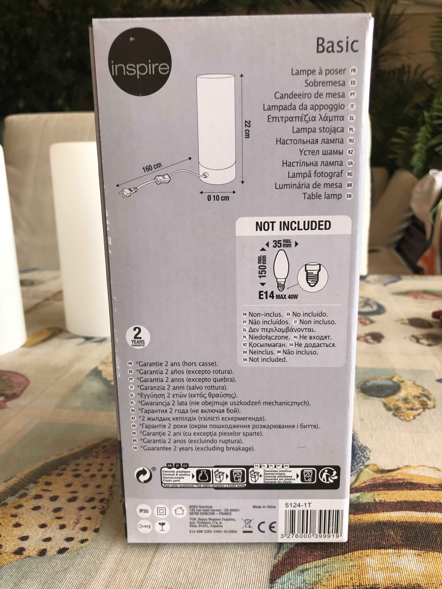
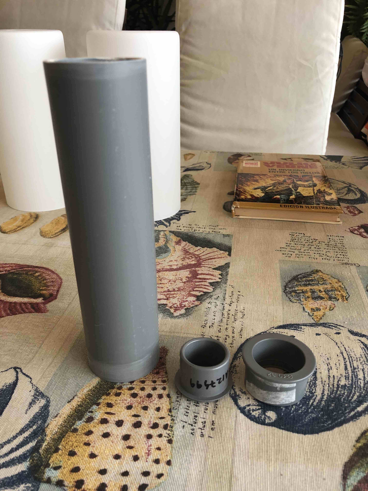
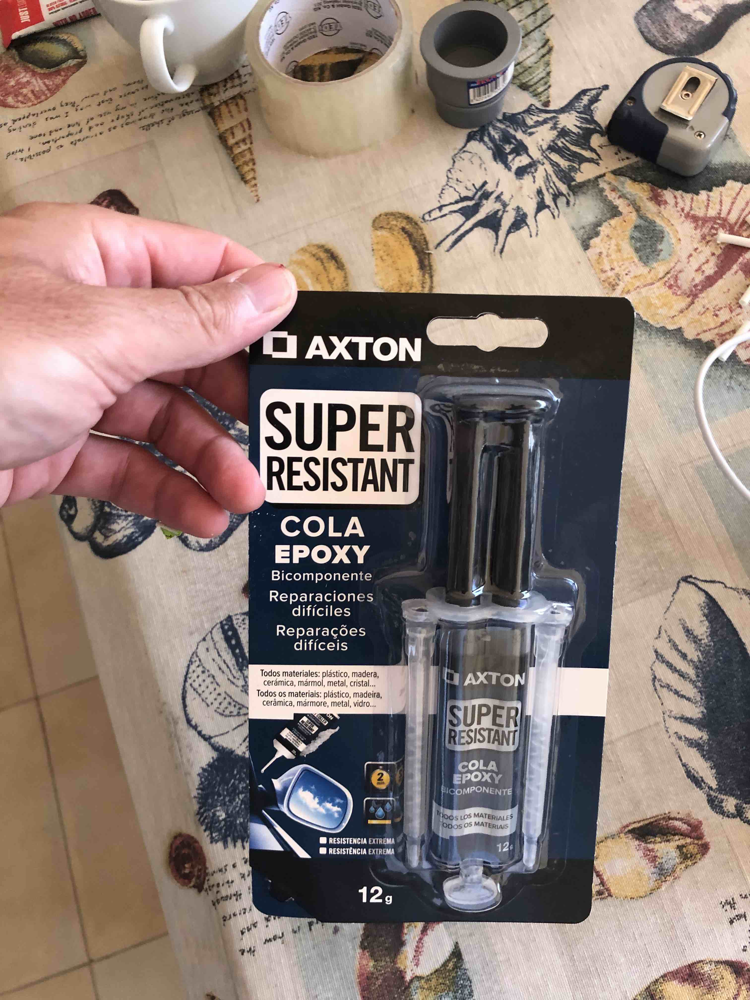

# Esta es el Proyecto de la Lampara Inteligenta
*(el autor de esta proyecto es Alex Gyver, nuestros hacemos solo mejorado y traducido)*

## Las partes que necesito para empresar esta proyecto:
  - El cuerpo:
    - Lampara de Leroy Merlin por sobre 8 euro (foto 1)
    - Tubo fontanera D50 1m  por sobre 5 euro (foto 2)
    - Tapón reducción 32/40 por sobre 1 euro (foto 2)
    - Tapón 32 por sobre 1 euro (foto 2)
    - Pegamento epoxi por sobre 5 euro (foto 3)
  - El cables D0.15 sobro 1 m por sobre 1 euro
  - Los partes electrónicas (todos de aliexpres por sobre 20 evro, listo 1):
    - WeMos D1 microcontroler (foto 5)
    - Buton tactil TTP223 (foto 6)
    - Condensador 470mF >10V 
    - Panal de pixeles SMD Flexible LED 16x16
  - Los instrumentos:
    - Soldador
    - Taladradora
    - Sierra
    - Papel de lija
  - El ordenador y software:
    - Mac/Linux/Windows ordenador
    - Arduino software (https://www.arduino.cc)
    - USB cable para conexión entera el ordenador y WeMos (el tipo depende de WeMos y ordenador, para mi estuve tipo-C)
  - Un poco conocimiento que a programar

Foto 1

Foto 2

Foto 3

### Listo 1
- [WeMos](https://www.aliexpress.com/item/32831353752.html?spm=a2g0o.productlist.0.0.44ff2f11lVnfWd&algo_pvid=5b1578a4-7c16-4752-9952-12276110f34a&aem_p4p_detail=2022102107022213559363347472640000346956&algo_exp_id=5b1578a4-7c16-4752-9952-12276110f34a-1&pdp_ext_f=%7B%22sku_id%22%3A%2210000014440741148%22%7D&pdp_npi=2%40dis%21EUR%212.03%212.03%21%21%211.4%21%21%402100bddd16663609425045245ed45e%2110000014440741148%21sea&curPageLogUid=HrLIq9Tt94nc&ad_pvid=2022102107022213559363347472640000346956_2)
- [Buton tacti](https://www.google.com/url?sa=i&url=https%3A%2F%2Fes.aliexpress.com%2Fitem%2F32451378348.html&psig=AOvVaw0UCYNq85LD1kwoZ-cMa5-p&ust=1666447228505000&source=images&cd=vfe&ved=0CAsQjhxqFwoTCMiQme298foCFQAAAAAdAAAAABAD)
- [SMD Flexible LED](https://www.googleadservices.com/pagead/aclk?sa=L&ai=DChcSEwjP0bXWvfH6AhVEutUKHatKDG0YABAIGgJ3cw&ohost=www.google.com&cid=CAASJeRoIiMTTs2YsemtsOMaUqrh96dB2YpjZYGEJE1qm2M1diT5vHA&sig=AOD64_0HClVqk1m1lsXG1QnhkMOmN-sdIA&ctype=5&q=&ved=2ahUKEwiZu67WvfH6AhVQ3RoKHb6tBdsQ9aACKAB6BAgFEFY&adurl=)
